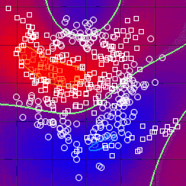

# Wek9_IP_Abel_Keya_K-nearest-neighbor-kNN-classifier-and-a-Naive-Bayes-classifier
This project involves Implementation of  a K-nearest neighbor (kNN) classifier  and a Naive Bayes classifier. After conducting the experiments the resulting metrics are  calculated 

# Problem statement:

**To conduct the experiments on the two datasets by  Building a K-nearest neighbor (kNN) model classifier  and a Naive Bayes model classifier calculate the resulting metrics.**

 
  
 
  
# Description

### Solution 1: Implementantion of the K-Nearest Neighboor algorithm on Titanic dataset

* Randomly partition each dataset into two parts i.e 80 - 20  sets.
* It has no  label for the test, use the train set to create train and test data (i.e. splitting further), 
* perform K-nearest neighbor  classification.

### Solution 2: Implementantion of the Naive Bayes Classifier
* perform classification of the testing set samples using the Naive Bayes Classifier.
* Compute the accuracy (percentage of correct classification).
* Report the confusion matrix of each classifier.
* Repeat step 2 to step 4 twice, each time splitting the datasets differently i.e. 70-30, 60-40, then note the outcomes of the modeling.

#### Suggest and apply at least one of the optimization techniques.

#### Provide further recommendations to improve both classifiers.

# Context 

## Dataset 1

On April 15, 1912, the largest passenger liner ever made collided with an iceberg during her maiden voyage. When the Titanic sank it killed 1502 out of 2224 passengers and crew. This sensational tragedy shocked the international community and led to better safety regulations for ships. One of the reasons that the shipwreck resulted in such loss of life was that there were not enough lifeboats for the passengers and crew. Although there was some element of luck involved in surviving the sinking, some groups of people were more likely to survive than others.

##3 Data Features

The [dataset1](https://github.com/abel-keya/week9_IP_Abel_Keya_K-nearest-neighbor-kNN-classifier-and-a-Naive-Bayes-classifier/blob/master/train%20(5).csv) has the following features:
The titanic.csv file contains data for 887 of the real Titanic passengers. Each row represents one person. The columns describe different attributes about the person including:

* survived
* Age
* passenger-class
* sex
* fare they paid (X)
* Embarked

## Dataset 2

The "spam" concept is diverse: advertisements for products/web sites, make money fast schemes, chain letters, pornography...

The dataset is  collection of spam e-mails came from our postmaster and individuals who had filed spam. The collection of non-spam e-mails came from filed work and personal e-mails

##3 Data Features

The [dataset2](https://github.com/abel-keya/week9_IP_Abel_Keya_K-nearest-neighbor-kNN-classifier-and-a-Naive-Bayes-classifier/blob/master/spambase.zip) has the following features:

* Data Set Characteristics: Multivariate
* Number of Instances:4601
* Industry source: Computing
* Attribute Characteristics:Integer, Real
* Number of Attributes:57
* Missing Values?:Yes
* Number of Web Hits:510321

# Requirements
* Anaconda installation
* Google colab
* Setup instruction
> * Save a copy of the notebook in your drive and open it to access.

   
   # Technologies used:
   
 
 
   
  
 

# Support
In case of any clarifications or suggestions with regards to this project email me at jumakeya@gmail.com

License
Copyright (c) 2020 **Abel Keya**
